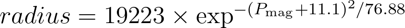

## Mask Regions Around Saturated Stars and Near-Border Objects in S-PLUS Data

This Python script is designed to prepare S-PLUS (Southern Photometric Local Universe Survey) data by applying masks to the S-PLUS catalogues. Here's a breakdown of what the script does:

## Function Definitions:

The script contains several function definitions:
```python
get_splusfootprint():
```
Retrieves the S-PLUS footprint from a CSV file.
```python
query_gsc():
```
Queries the GSC1.2 catalog using the Vizier service based on RA and DEC coordinates.
```python
get_stars():
```
Processes FITS image files to extract information about stars and S-PLUS objects.
```python
plot_stars():
```
Plots stars and S-PLUS objects on FITS images.
```python
make_masks():
```
Generates masks based on S-PLUS and GSC catalogs.
```python
check_distance_to_border():
```
Checks the distance of objects to the field borders.
```python
main():
```
The main function that orchestrates the entire process by parsing arguments, retrieving necessary data, processing it, and generating output.

## Execution

Finally, the script executes the main() function if it's run as the main program.

This script is designed to be executed from the command line, taking various parameters to customize its behavior. It processes S-PLUS data, applies masks based on GSC catalogs, and outputs masked catalogs. Additionally, it can plot the processed data for visualization.

## Metodology

Bright stars are common in the S-PLUS images and can be a significant factor of contamination of science sources depending on the scientific subject intended for the data. For this reason, we provide a Value-added Catalog (VAC) containing masks for S-PLUS objects near bright stars (which are often saturated). The procedure involves querying the GSC catalog (I/254) to get all bright stars within a radius of one deg around the central coordinates of a given field, and calculating the radius of a circular area around each queried star. The radius is calculated based on the brightness of the GCS star by using the exponential equation below:



which was chosen via an empirical fit using S-PLUS images to define the constants of the equation. Only stars with GSC P_\mathrm{mag} < 14 are used to create masks and the minimum radius is set to 30 pixels (16.5 arcsec). Any S-PLUS object within the radius of a GSC star is flagged with a unitary integer value (a source within the radius around one GSC star gets MASK = 1). All S-PLUS objects with MASK = 0 are not within any GSC star radius. During our tests, we found that some stars that appear saturated in the S-PLUS images are not present in the GSC catalog, therefore not being accounted for the mask creation. The number of "missing" stars was estimated to be around 1%.

In addition to this, we also identify any S-PLUS object located at a distance larger than 0.6917 deg from the orthogonal lines crossing the center of any given field for RA and Dec (or around 30 arcsec from any border). These sources are denominated "near to the border" (NTTB) objects and they receive a flag 2, which is added to the saturation mask. In this case, a NTTB source inside a saturation ring will have MASK = 3 or 2 otherwise.

The figure below shows the S-PLUS field STRIPE82-0001 where:
- cyan: circle around the GSC star within which the S-PLUS sources are considered "near of saturated object";
- red: S-PLUS sources near saturated object;
- yellow: S-PLUS object is less than 30 arcsec from a border;
- orange: close to the border AND near saturated object.


Please note that S-PLUS objects with MASK = 0 do not necessarily mean they are devoid of contamination. The object can still be near a stellar spike but outside of the "saturation radius" and, therefore, contaminated to some extent. These features are extremely difficult to estimate and there is ongoing work within the technical team to develop a tool that can tackle such issue. However, objects that have MASK=1 or 3 are most likely to be contaminated and, therefore, must be considered carefully.

The code can be found in the [source directory](../src/).
