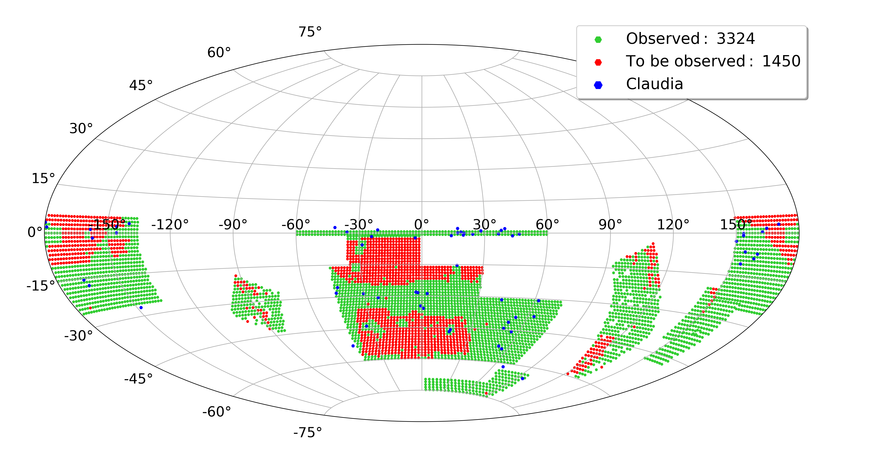

# Plot S-PLUS Footprint on the Sky

This script plots the S-PLUS footprint on the sky using the tiles_nc.csv file and the 2MASS all sky catalog.

## Usage

```
python plot_footprint.py
```

## Output

The script will output a PNG file called `splus_footprint.png`.



## Notes

The 2MASS catalog is available at http://cdsarc.u-strasbg.fr/viz-bin/Cat?II/281

## Author

Fabio R Herpich - CASU/IoA U. of Cambridge
